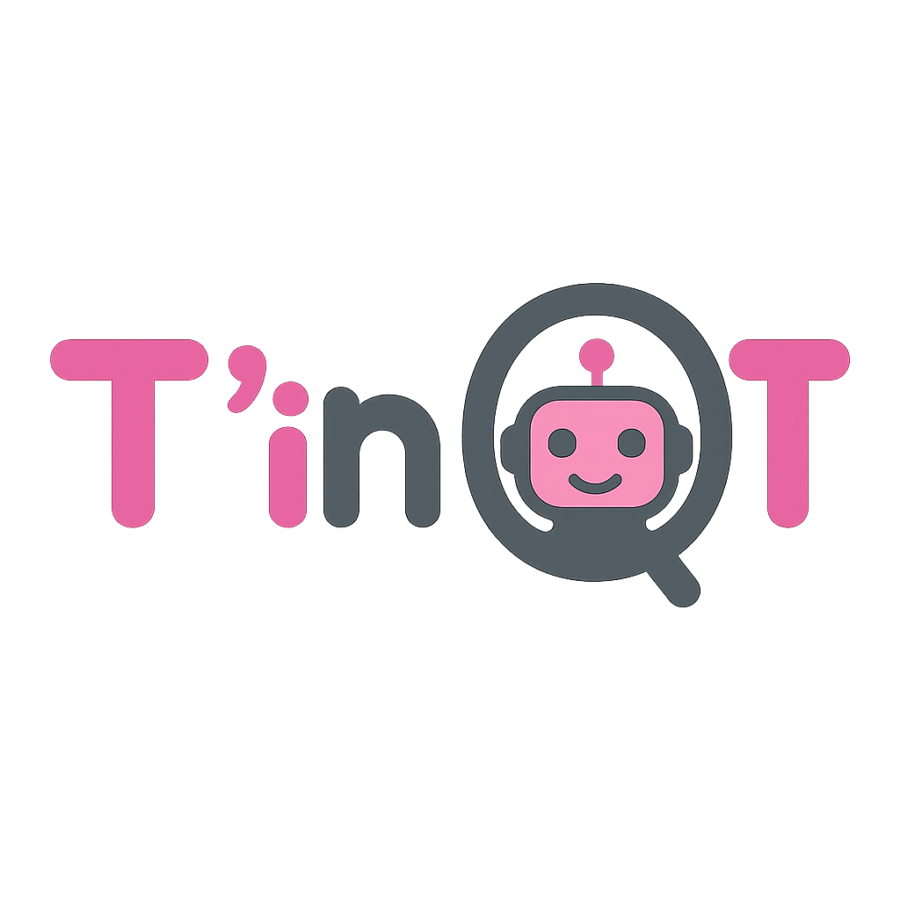

<p align="center">
  
</p>

**TinQT** est un site web interactif développé dans le cadre du projet pédagogique **HAI810** de **L'Université de Montpellier**.
#
TinQT s’adresse aux enfants a partir de 4 et propose la lecture d’histoires en compagnie du robot QT, qui accompagne **la narration** par des **expressions émotionnelles** et une **voix synchronisée**.
Le site est disponible en **Français** 🇫🇷 et en **Anglais** 🇬🇧.

---

## Objectifs 
- Développer l'imagination et l'écoute des jeunes enfants.
- Encourager la compréhension des émotions à travers le personnage robotisé.
- Initier à la lecture bilingue de façon ludique et interactive.


##  Fonctionnalités
-  Interface bilingue : Français / Anglais.
-  6 histoires interactives disponibles (`La Cape Magique de Zoé` ,`L’Étoile Perdue `,`Le Nuage qui Voulait Voyager`,`L'Escargot et la Course`,
`Le Loup au Cœur en Montagnes Russes`,`L'Éléphant qui Avait Peur de l'Eau`).
-  Narration vocale avec `API Web Speech`.
-  Illustrations et émotions affichées pendant la lecture.
-  Interface adaptée aux jeunes enfants (grandes images, personnage, navigation simple).  
 
##  Narration vocale intégrée

La lecture des histoires est assurée par la **API Web Speech**.  
Elle permet de :
- Lire les histoires.
- Contrôler la narration (pause, arrêt, etc.).
- Changer la langue (FR / EN).
- Synchroniser la voix avec les émotions affichées.
---
## Structure du projet 

```bash 
src/
│
├── assets/               # Images utilisées (personnages, émotions, accueil)
│   ├── character/
│   ├── emotion/
│   └── homeimage/
│
├── Histoires/            # Fichiers composants pour chaque histoire
│   ├── H1.tsx à H6.tsx
│
├── traduction/           # Fichiers de traduction pour i18n
│   ├── en.json
│   └── fr.json
│
├── i18n.ts               # Configuration de la traduction
├── App.tsx               # Composant racine
├── Home.tsx              # Page d’accueil
├── main.tsx              # Entrée principale de l'application
├── index.css             # Styles globaux
├── App.css               # Styles des composants 
```
---

## Installation

```bash
git https://github.com/meradamiradjihane/TinQt.git
cd PROJET_CP
npm install
```

## Lancement de  l'application
```bash
npm run dev       # Lancer le serveur de développement
npm run build     # Générer un build de production
npm run preview   # Prévisualiser le build
```
---
## Auteur 
- MERAD Amira djihane.
- BOUABOUD Karima. 
- AMARA Rafik.

## Technologies utilisées 
React + Vite + TypeScript. 
